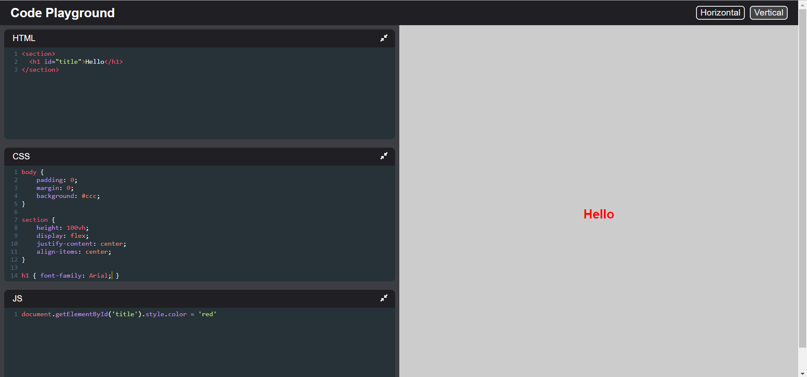
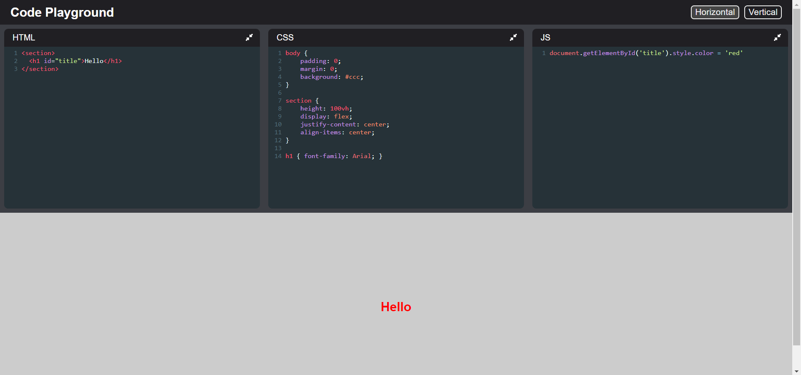

# Code Playground

An Code Pen clone made with React and Typescript

---

## Topics covered in this project:

- React
    - Hooks
        - useState
        - useEffect
        - Custom Hooks

- Typescript

- LocalStorage

---

## Getting started

- Clone the repository
```
    git clone https://github.com/j-barreiros/code-playground.git
```

- cd into directory
```
    cd code-playground
```

- Install dependencies
```
    npm install
```
- Start the app
```
    npm start
```

---

## Project Layout

### Vertical Mode


### Horizontal Mode
